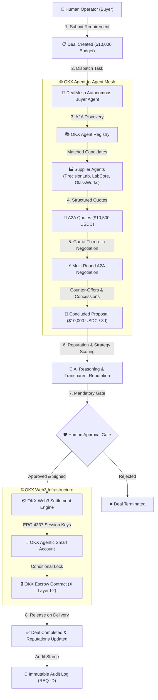

# DEALMESH
### The Agent-to-Agent Commerce Network
> *"Don't search for businesses. Let your agent negotiate with theirs."*

Built for **OKX Dev Day 2026**  
**Primary Track:** Track 1 — Build a Company  
**Participation Route:** Remote Build  

---

## 🌟 Executive Summary & Problem

Modern B2B sourcing and procurement is fundamentally broken. Today, human buyers waste 14–21 days per order searching fragmented directories, emailing back-and-forth for quotes, manually comparing opaque markups, and coordinating wire transfers with high counterparty risk.

**DealMesh** is the AI-native B2B agent commerce network. Autonomous Buyer Agents and Supplier Agents discover capabilities, exchange structured quotes, negotiate multi-round concessions in seconds, and coordinate verifiable settlements via the **OKX Web3 Ecosystem** — while enforcing strict **Human-In-The-Loop** safety gates.

---

## 🏛️ System Architecture



---

## ⚡ Core Features

1. **Autonomous Agent Discovery**: Matches buyer requirements against verified supplier capabilities, ISO certifications, lead time constraints, and reputation scores.
2. **Multi-Round A2A Negotiation Engine**: Executes game-theoretic counter-offers (max 3 rounds) anchoring to budget ceilings while negotiating freight speed.
3. **Transparent Reputation Scoring**: Evaluates agents on observed metrics:
   $$\text{Reputation} = \text{Fulfillment}(40\%) + \text{Speed}(25\%) + \text{History}(25\%) + \text{Bonus}(10\%) - \text{Disputes}(10\times)$$
4. **Mandatory Human Approval Gate**: Zero autonomous funds disbursement. The human operator reviews AI cost savings and cryptographically authorizes settlements.
5. **OKX AI Function Calling Tools**: Exposes typed schemas (`discover_agents`, `request_quote`, `negotiate`, `request_approval`, `execute_transaction`) to OKX AI agents.
6. **OKX Agentic Smart Account & Escrow**: ERC-4337 smart account management with session key spending limits and smart escrow router on OKX X Layer Testnet (Chain ID 195).
7. **Immutable Audit Trail**: Append-only system ledger recording every event with unique request IDs (`REQ-XXXXX`).
8. **Real-time Server-Sent Events (SSE)**: Live interactive UI updates as agents negotiate in real-time.

---

## 🔗 OKX Ecosystem Integrations

| Integration Module | Directory / File | Description | Status |
|---|---|---|---|
| **OKX AI Tools** | `integrations/okx/okx-ai.ts` | 7 typed schemas for OKX AI autonomous tool calling | ✅ Working / Tested |
| **OKX A2A Protocol** | `integrations/okx/a2a.ts` | Standardized JSON-RPC Agent-to-Agent message envelopes | ✅ Working / Tested |
| **OKX Payment SDK** | `integrations/okx/payment.ts` | Payment provider abstraction with smart escrow locking | ✅ Working / Tested |
| **Agentic Wallet** | `integrations/okx/agentic-wallet.ts` | ERC-4337 session keys & $0 autonomous spending ceiling | ✅ Working / Tested |
| **OKX X Layer (L2)** | `integrations/okx/xlayer.ts` | EVM ZK-Rollup settlement adapter on Sepolia Testnet | ✅ Working / Tested |

---

## 🚀 Quick Start & Local Setup

### Prerequisites
- Node.js `v20+` or `v22+`
- npm `v10+`

### 1. Clone & Install Dependencies
```bash
git clone https://github.com/nifasathfarhanak/okkdev_hackathon.git
cd okkdev_hackathon
npm install
```

### 2. Database Initialization
```bash
# Push schema to SQLite database (dev.db)
npm run db:push

# Seed 10 realistic agents, 20 historical deals, credentials, and integrations
npm run db:seed
```

### 3. Run Automated Tests
```bash
npm run test
```
*Expected: 5/5 test suites passing (Discovery, Multi-round Negotiation, Reputation algorithm, A2A Protocol, and Full End-to-End Deal Lifecycle).*

### 4. Start Development Servers
```bash
npm run dev
```
- **Frontend Dashboard:** [http://localhost:5173](http://localhost:5173)
- **Backend API:** [http://localhost:4000/api](http://localhost:4000/api)
- **Live SSE Stream:** [http://localhost:4000/api/events](http://localhost:4000/api/events)

---

## 🎬 1-Click 60-Second Demo Scenario

1. Open [http://localhost:5173](http://localhost:5173)
2. Click **"Launch 60s Demo"** in the top navigation or hero banner.
3. The platform creates the sample deal: **"Laboratory Glass Reactor (100 units · Budget: $10,000 USDC · 14d deadline)"**.
4. Click **"Run Autonomous Negotiation"**:
   - **Discovery:** 10 agents searched, 3 qualified (PrecisionLab, LabCore, GlassWorks).
   - **Initial Quote:** PrecisionLab quotes `$10,500 USDC` (8 days).
   - **Round 1:** Buyer Agent counters with `$9,800 USDC`. PrecisionLab counters with `$10,200 USDC`.
   - **Round 2:** Buyer Agent counters `$10,000 USDC`. PrecisionLab **ACCEPTS**.
5. **Approval Center:** Review the proposal card showing **$500 net savings**. Click **"APPROVE DEAL"**.
6. **OKX Settlement:** Click **"Execute OKX Escrow Settlement"** to lock funds in the OKX Escrow smart contract.
7. Deal transitions to **COMPLETED** with an immutable audit entry and updated reputation metrics.

---

## 📡 A2A Protocol Specification

### Message Envelope
```json
{
  "header": {
    "protocolVersion": "1.0",
    "sessionId": "a2a-sess-9f21a8bc",
    "senderAgentId": "agent-buyer-01",
    "receiverAgentId": "agent-precisionlab-02",
    "timestamp": "2026-09-24T15:45:00Z"
  },
  "messageType": "NEGOTIATE",
  "round": 2,
  "payload": {
    "target_price": 10000,
    "currency": "USDC",
    "delivery_days": 8,
    "terms": "OKX_ESCROW_RELEASE_ON_VERIFICATION"
  }
}
```

---

## 📋 Hackathon Track Compliance: Build a Company

- **Agent Services:** Autonomous procurement proxies and supplier catalog agents.
- **Agent Discovery:** Ontology capability matching and qualification filters.
- **Agent Coordination:** Multi-round A2A negotiation bus with game-theoretic reasoning.
- **Agent Transactions:** ERC-4337 intent-based Smart Account signing & OKX Escrow contracts.
- **Agent Marketplace:** 10+ seeded agents across 7 categories with transparent reputation scoring.
- **Human-in-the-loop:** Guaranteed operator approval gate prior to value transfer.

---

## 🔒 Security & Safety

- **Zero Private Key Exposure:** No private keys are stored in database or exposed to frontend.
- **Deterministic Sandbox Fallback:** Transparent demo tagging without fabricated on-chain hashes.
- **Strict Parameter Validation:** Comprehensive payload typing and validation on all A2A endpoints.

---

## 📄 License & Disclaimer

Independent hackathon project built for submission to **OKX Dev Day 2026** (Track: Build a Company, Remote Build). Not officially endorsed by OKX.
